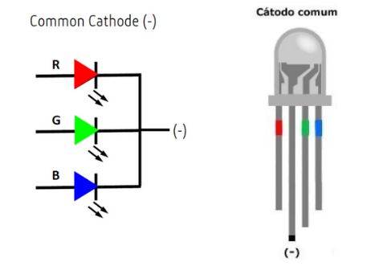
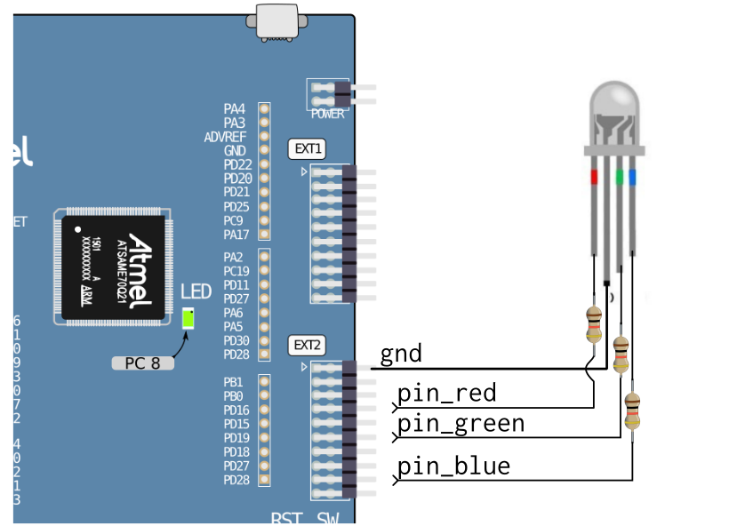
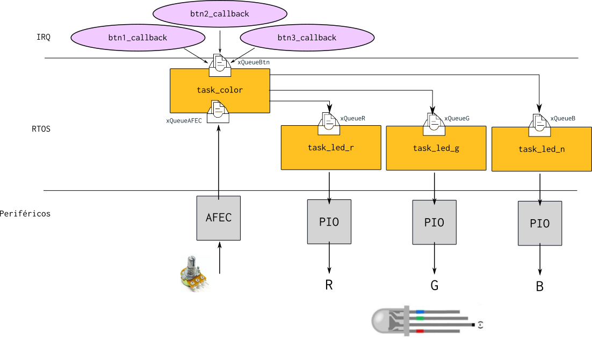

# 23b - emb  - av3

Prezado aluno:

- A prova é prática, com o objetivo de avaliar sua compreensão a cerca do conteúdo da disciplina. 
- É permitido consulta a todo material pessoal (suas anotações, códigos), lembre que você mas não pode consultar outros alunos.
- Duração total: 3h (sem acréscimo!)

Sobre a avaliação:

1. Você deve satisfazer ambos os requisitos: funcional e código para ter o aceite na avaliação;
1. A avaliação de C deve ser feita em sala de aula por um dos membros da equipe (Professor ou Técnico);
2. A entrega do código deve ser realizada no git.

**Você vai precisar:**

- ▶️ Kit SAME70-XPLD
- ▶️ Conectar o OLED1 ao EXT-1
- ▶️ 1x Potenciômetro 
- ▶️ 1x LED RGB (Cátodo Comum)
- ▶️ 3x Resistor 330R

**Periféricos que vai precisar utilizar:**

- PIO
- AFEC
- UART console (printf)

**Código exemplo fornecido:**

No código fornecido (e que deve ser utilizado) os botões e LEDs da placa OLED já foram inicializados na função (`io_init`) e os callbacks dos botões já estão configurados. Temos uma `task_oled` que é inicializada e fica exibindo no OLED um ponto piscando. Pedimos para **não alterar** nada nessa task, pois ela serve de debug para sabermos se o seu programa travou (se o ponto parar de piscar, tem alguma coisa errada com o seu programa).

## Descritivo
#
Vamos criar um sistema protótipo de um abajur colorido. Para isso, será necessário controlar um LED RGB via um PWM em cada uma de suas cores.


### LED RGB

O LED RGB é um componente eletrônico que possui, em um único encapsulamento, três LEDs de cores: Vermelho (R), Verde (G) e Azul (B). Combinando a intensidade de cada uma das cores, conseguimos criar novas cores. O dispositivo que iremos utilizar é do tipo Cátodo comum, ou seja, o ponto em comum é o terra.



Cada pino do LED RGB deve então ser conectado a um pino do nosso microcontrolador, utilizando um resistor (para limitarmos a corrente). Vocês devem tratar cada pino do LED como uma saída, assim como fazemos com qualquer LED! A figura a seguir fornece um esquema de ligação simplificado:



### PWM

Para conseguirmos controlar a intensidade de cada cor, será necessário criarmos um PWM em cada um dos pinos do LED. O PWM é um sinal simples que mantém parte do tempo o valor em `1` e outra parte em `0`. Quanto mais tempo o valor ficar em `1`, mais intenso será a luz da cor específica.


Existem várias formas de gerarmos um PWM no microcontrolador. Eu vou propor uma que não é a melhor (o certo seria usarmos um periférico que chama PWM para isso, mas eu quis simplificar aqui). Vamos realizar o PWM por software! Muito similar ao sinal que vocês fizeram na APS1, o código a seguir ilustra como vocês devem criar o PWM em cada um dos pinos, note que o termo o duty cycle máximo ocorre quando `t=20` e o mínimo quando `t=0`. Nesse exemplo, nós só possuímos `20` níveis de PWM, mas que para nós será mais que o suficiente!

```c
int t = 10;
while(1){
    pio_set(PIO_PIN, PIO_PIN_MASK);
    delay_ms(t);
    pio_clear(PIO_PIN, PIO_PIN_MASK);
    delay_ms(20-t);
}
```

### Visão geral do firmware

A funcionalidade esperada é a seguinte: Cada botão da placa OLED será usado para configurar a intensidade de uma das cores do LED RGB, ou seja, o botão 1 controla o vermelho, botão 2 o verde e o botão 3 o azul. O potenciômetro vai servir para ajustarmos a intensidade da cor. Enquanto o botão da cor específica estiver pressionado, o valor da intensidade vai ser proporcional ao valor lido no potenciômetro, quando liberado o botão, o valor fica fixo no último.



> ## Regras de software
> 
> - Seguir a estrutura de firmware descrita!
> - Não usar variável global (apenas recursos do RTOS)
> - Passar no codequality 


O firmware vai ser composto por quatro tasks: `task_color`, `task_led_r`, `task_led_g` e `task_led_b`, e por cinco filas: `xQueueAFEC`, `xQueueBtn`, `xQueueR`, `xQueueG`, `xQueueB`.

Onde:

- `task_color`: Faz a leitura das informações dos botões e do AFEC, envia o dado do novo valor para cada uma das tasks específicas que controlam cada um dos LEDs, isso é feito via as filas.
- `task_led_r`, `task_led_g`, `task_led_b`: Geram o PWM para cada um dos leds respectivos, fazem a leitura do valor do duty cycle via a fila específica.
- `xQueueR`, `xQueueG`, `xQueueB`: Fila para receber os novos valores de duty cycle referente a cada cor.
- `xQueueBtn`: Recebimento de dados dos botões (id e status).
- `xQueueAFEC`: Recebimento do valor do AFEC.

### Dicas

1. Comece implementando a `task_color`. Implemente a lógica para detectar quando o botão está pressionado, lembrando de ler o dado na fila `xQueueBtn`.
    - Acenda o LED específico do botão enquanto ele estiver pressionado.
1. Implemente a leitura do AFEC e a leitura do dado na task_color (via a fila `xQueueAFEC`).
1. Escolha três pinos e conecte o LED neles, lembrando de configurar os pinos como saída. Também conecte o pino de negativo no GND.
1. Implemente a `task_led_r` e faça ela controlar, via PWM, o LED vermelho.
    - Envie dados para a fila do LED vermelho e teste.
1.  Implemente as outras cores.
